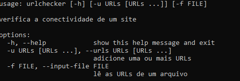

### Este é um projeto que verifica a conectividade de URLs inseridas pelo usuário.

**Como rodar o projeto:** 
* Passo 1: Clonar o repositório 
* Passo 2: instalar venv com ``apt install python3.8-venv``
* Passo 3: Criar o ambiente virtual para o projeto,  
No windows:  ``python -m venv venv`` 
* Passo 4: Ativar o ambiente virtual 
No Windows: ``venv\Scripts\activate`` 
* Passo 5: Instalar as dependências com o pip ``python -m pip install aiohttp``

**Os arquivos:**  
  *  __init__.py permite que a pasta rpchecker seja lida como um Pacote do Python
  * __main__.py funciona como a função inicial que vai executar o programa de verificação de URLs
  * checker.py é onde estão localizadas as funcionalidades chave da aplicação 
  * cli.py é onde estão os comandos da interface com o usuário (Facilitaria a comunicação com um projeto front-end por exemplo)

**Rodando o pacote:** 
* Abra o terminal na pasta que você clonou e digite o seguinte comando
``python -m urlchecker -h``
* Irá aparecer as seguintes informações: 

* Em seguida execute a operação que deseja. Você pode consultar a URL desejada inserindo-a no terminal, da seguinte maneira ``python -m rpchecker -u <insira aqui sua url>``
